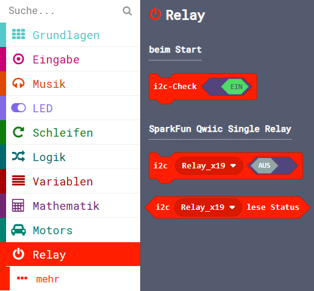

Diese Seite bei [https://calliope-net.github.io/relay/](https://calliope-net.github.io/relay/) öffnen.

**Das 'SparkFun Qwiic Single Relay' funktioniert nur mit dem Calliope mini V3.**

**Am Calliope mini 1 und 2 blockiert das 'Relay' den i2c-Bus und kann nicht verwendet werden.**

### Calliope Erweiterung für das i2c Modul:

* [SparkFun Qwiic Single Relay](https://www.sparkfun.com/products/15093)

Dieses Repository kann als **Erweiterung** in MakeCode hinzugefügt werden.

* öffne [makecode.calliope.cc](https://makecode.calliope.cc)
* klicke auf eine Projektvorlage
* klicke unter dem Zahnrad-Menü auf **Erweiterungen** (oder bei den Blöcken ganz unten)
* kopiere die folgende **Projekt-URL** in die Zwischenablage (Strg-C)
* **calliope-net/relay**
* füge sie auf der Webseite oben ein (Strg-V) und klicke auf die Lupe (oder ENTER)
* wenn die Erweiterung gefunden wurde, klicke auf das Rechteck
* jetzt hat die Liste den neuen Eintrag **Relay** bekommen

### Beschreibung der Erweiterung für 'SparkFun Qwiic Single Relay'

Es könnte die einfachste i2c-Erweiterung sein, die es gibt: Eine (binäre) 0 an die i2c-Adresse gesendet schaltet das Relais aus, eine 1 schaltet es ein.
Beim Calliope mini V3 funktioniert das tatsächlich so. (Relay-englisch, Relais-deutsch Herkunft französisch.)

Beim Calliope 1 und 2 ist die i2c-Adresse 0x18 schon intern belegt. Intern belegt sind 3 Adressen 0x10, 0x18 und 0x68. Diese können von Modulen nicht verwendet werden. 
Auch wenn die i2c-Adresse geändert wurde (mit Lötbrücke oder Software), blockiert das Modul trotzdem beim Einschalten den gesamten i2c-Bus und kann am Calliope 1 und 2 nicht verwendet werden. 

Calliope 3 hat einen getrennten i2c-Bus intern und extern. Somit sind extern alle i2c Adressen verfügbar. 
Das 'SparkFun Qwiic Single Relay' funktioniert mit der originalen und auch mit geänderten i2c-Adressen.

<!--
Bei diesem Modul kann die i2c-Adresse geändert werden: entweder durch eine Lötbrücke in 0x19, dann ist der Adresskonflikt gelöst.
Oder mit einem i2c-Command-Code an 0x18. Das funktioniert, obwohl die 0x18 intern belegt ist. Hier wurde in 0x1E geändert. Erlaubt ist jede 7-Bit i2c-Adresse.
Und die Änderung bleibt erhalten. Wenn das Modul wieder an geschaltet wird, hat es immer noch die 0x1E in diesem Beispiel.
Anmerkung: Wenn die Lötbrücke vorhanden ist, wird die geänderte i2c-Adresse beim Ausschalten vergessen. Beim Einschalten gilt immer die 0x19. Damit müsste es nun funktionieren.

Der zweite Umstand ist, dass sich der gesamte i2c-Bus beim Einschalten aufhängt, wenn das Relay Modul angesteckt ist, egal mit welcher i2c-Adresse. Es wird dann überhaupt kein i2c-Modul erkannt, auch kein 
internes. Das kann verhindert werden, wenn das Relay Modul erst nach dem Einschalten an den i2c-Bus gesteckt wird. Dann sind die anderen 'Devices' am i2c-Bus bereit und die Adresse 0x19 oder 0x1E ebenfalls.
Es ist aber nicht praktikabel, Hardware anzustecken nachdem der Strom eingeschaltet wurde.

Die erfolgreichen Tests, i2c-Adresse ändern, Ein und Aus schalten mit der neuen i2c-Adresse, funktionierten nur mit Anstecken nach dem Einschalten.

Der dritte Umstand ist, dass ein Relais bei 3 Volt einen bemerkenswerten Strom braucht, wenn es An ist. Das verträgt der i2c-Bus möglicherweise nicht. Ebenso das Schalten der induktiven Last.
Das ist mit einer externen 3,3V Stromversorgung zu lösen. (Achtung! Qwiic verträgt keine 5 Volt!) 
Aber auch damit bleibt der Umstand, dass sich der gesamte i2c-Bus beim Einschalten aufhängt, wenn das Relay Modul angesteckt ist.
Der Strom kann auch nicht der Grund sein, solange das Relais Aus ist. Und mit dem Trick 'Anstecken nach dem Einschalten' hat das Relais auch am normalen Bus hörbar geklickt.

**Das 'SparkFun Qwiic Single Relay' blockiert den i2c-Bus und kann am Calliope nicht verwendet werden.**

Wer die Ursache dafür findet, möge das bitte mitteilen. (Getestet wurde mit 2 Modulen von verschiedenen Händlern mit dem gleichen Ergebnis. Dass beide kaputt sind, ist nicht sehr wahrscheinlich.)
-->

### Erweiterungen

> [Upates für Erweiterungen; Erweiterungen aus einem Projekt löschen.](https://calliope-net.github.io/i2c-liste#updates)

> [Alle i2c-Erweiterungen für MakeCode von calliope-net (Software).](https://calliope-net.github.io/i2c-liste#erweiterungen)

#### Calliope-Apps, .hex-Dateien, Bildschirmfotos mit Blöcken

> [Alle Beispiel-Projekte für MakeCode von calliope-net (Calliope-Apps).](https://calliope-net.github.io/i2c-liste#programmierbeispiele)

> GitHub-Profil calliope-net: [https://github.com/calliope-net](https://github.com/calliope-net)

### Bezugsquellen

> [Alle i2c-Module und Bezugsquellen (Hardware).](https://calliope-net.github.io/i2c-liste#bezugsquellen)

#### Metadaten (verwendet für Suche, Rendering)

* Calliope mini
* i2c
